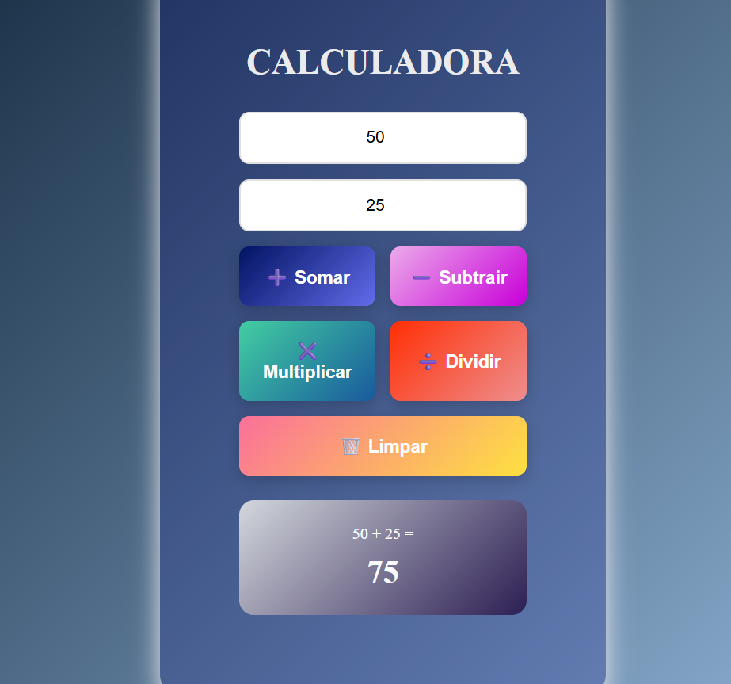

# 🧮 Calculadora Web

Minha primeira calculadora desenvolvida com HTML, CSS e JavaScript durante o 1º período de ADS (Análise e Desenvolvimento de Sistemas).

## 📸 Preview

## 🎯 Sobre o Projeto

Este é um projeto de estudos onde coloquei em prática os conceitos aprendidos nas aulas de **Práticas de Programação**:

- Estruturação HTML semântica
- Estilização com CSS (gradientes, animações, responsividade)
- Lógica de programação com JavaScript
- Manipulação do DOM
- Validação de dados

## ⚙️ Funcionalidades

- ➕ Adição
- ➖ Subtração
- ✖️ Multiplicação
- ➗ Divisão (com validação de divisão por zero)
- 🗑️ Limpar campos
- ⌨️ Atalho: pressione Enter no segundo campo para calcular

## 🛠️ Tecnologias Utilizadas

- HTML5
- CSS3
- JavaScript (Vanilla)

## 📚 O Que Aprendi

- Manipulação de elementos HTML com JavaScript
- Uso de estruturas condicionais (if/else, switch)
- Validação de entrada de dados
- Estilização avançada com CSS (gradientes, animações)
- Organização de código em arquivos separados

Projeto criado para aprendizado durante o 1º período de ADS.

## 👨‍💻 Autor

**Anderson Machado**
- Estudante de ADS - 1º Período
- www.linkedin.com/in/f-andersonmachado

---

⭐ Se este projeto te ajudou nos estudos, deixe uma estrela!
